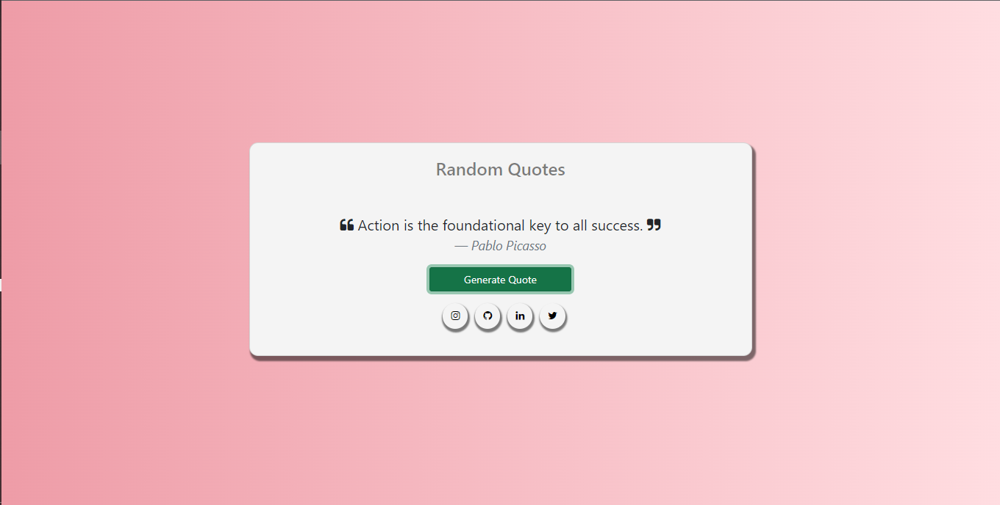

# Random Quotes Generator

## Description

   The Random Quotes Generator is a javascript project that generates random inspirational quotes at the click of a button.

   The project was built using a free fetch api [Random Quotes](https://type.fit/api/quotes). which is a great api i advised you check it out if you want to build something similar.

   I made use of Html, css and bootstrap to build the UI.

   The project helped me to learn the basics of asynchronous Javascript, an aspect of Javascript which i wish to explore further.

### Image

